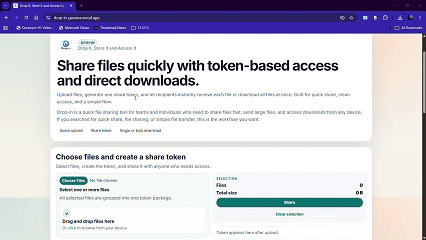
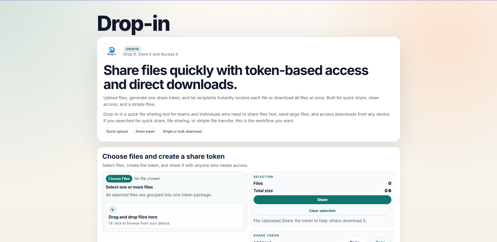
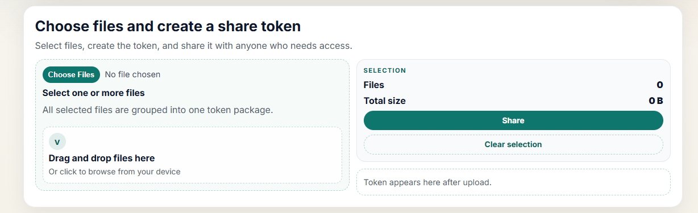
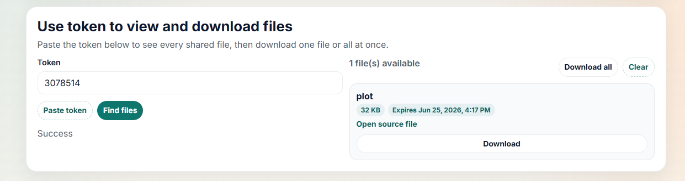

# Drop-In

<p align="center">
  
</p>

<h3 align="center">
Upload → Get Token → Share Token → Download
</h3>

<p align="center">
A file sharing platform that replaces links with simple tokens.
</p>

---

## Screenshots

<p align="center">
  
</p>

<p align="center">
  
</p>

<p align="center">
  
</p>

---

## Overview

Drop-In is a file sharing platform designed around a simple idea:

**Sharing a file should take seconds, not minutes.**

Upload a file, receive a unique token, send the token to someone, and they can download the file instantly.

No accounts.

No registration.

No sharing links.

No unnecessary steps.

Just a file and a token.

---

## How It Works

### 1. Upload

Choose a file manually or drag and drop it into the upload area.

### 2. Receive a Token

After the upload is complete, Drop-In generates a unique token.

Example:

```text
4839201
```

### 3. Share the Token

Send the token through any platform:

- WhatsApp
- Messenger
- Telegram
- Discord
- Email
- SMS

### 4. Download

Anyone with the token can retrieve and download the file instantly.

---

## Why Drop-In?

### Fast

Upload a file and start sharing immediately.

### Simple

A token is easier to remember and share than a long URL.

### Accessible

Retrieve files from any device with an internet connection.

### Frictionless

No accounts, onboarding, or permission management.

---

## Use Cases

### Documents

Share PDFs, reports, notes, assignments, and presentations.

### Images

Send photos and image collections quickly.

### Source Code

Transfer project archives, builds, and development resources.

### Media

Share videos, recordings, and other large files through a simple token.

---

## Upload Flow

```text
Select File
     │
     ▼
Upload
     │
     ▼
Token Generated
     │
     ▼
Share Token
```

---

## Download Flow

```text
Receive Token
      │
      ▼
Enter Token
      │
      ▼
File Located
      │
      ▼
Download
```

---

## Built With

- Next.js
- TypeScript
- Tailwind CSS
- Cloudinary

---

## Philosophy

Most file-sharing platforms continue to add more dashboards, settings, permissions, and complexity.

Drop-In focuses on a single task:

**Getting a file from one person to another as quickly as possible.**

Upload.

Get a token.

Share it.

Download.

---

## License

MIT License